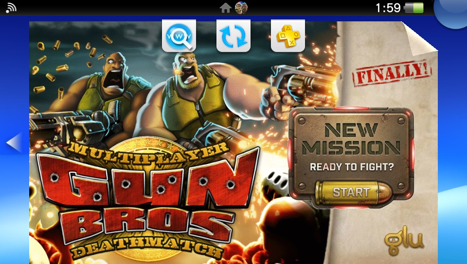
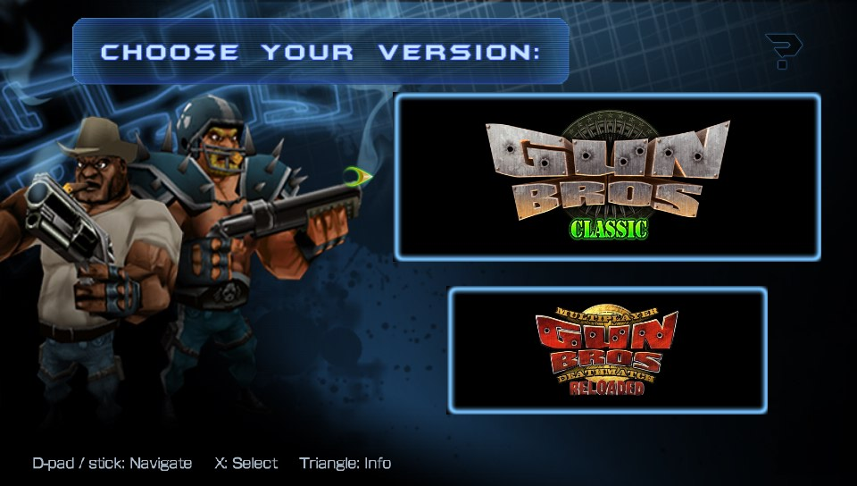
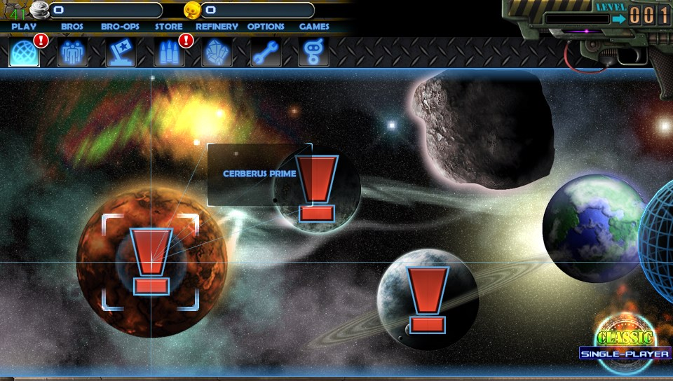
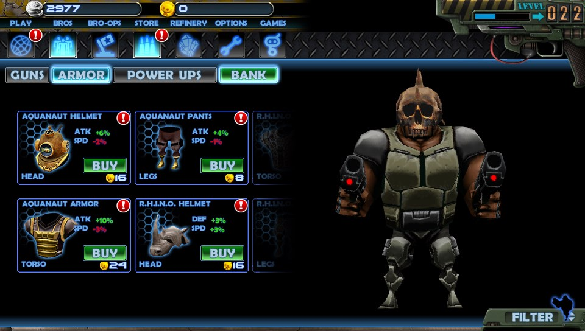
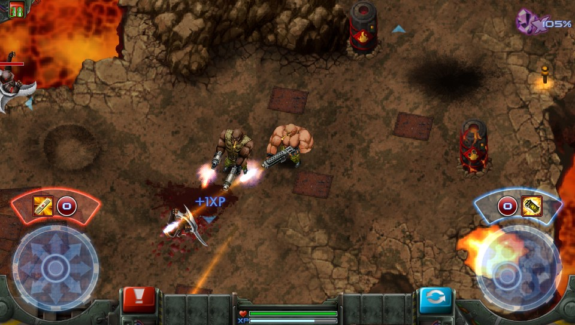
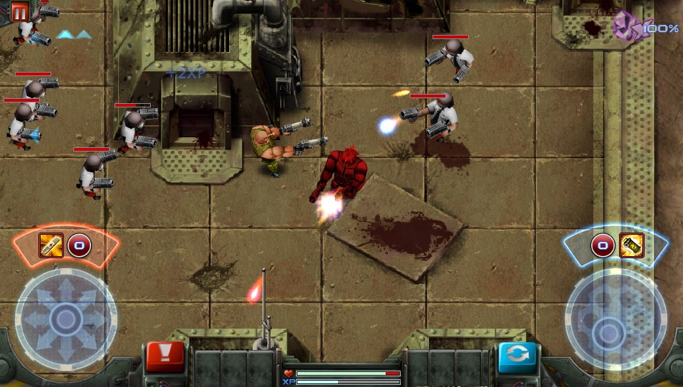
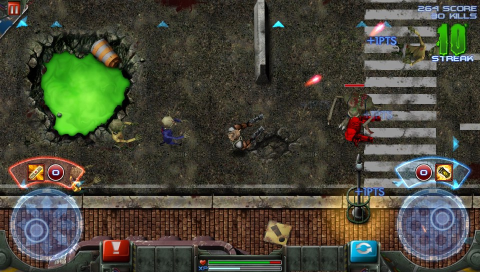
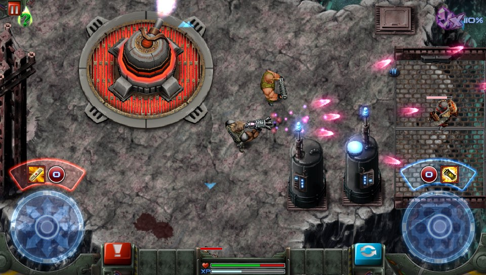
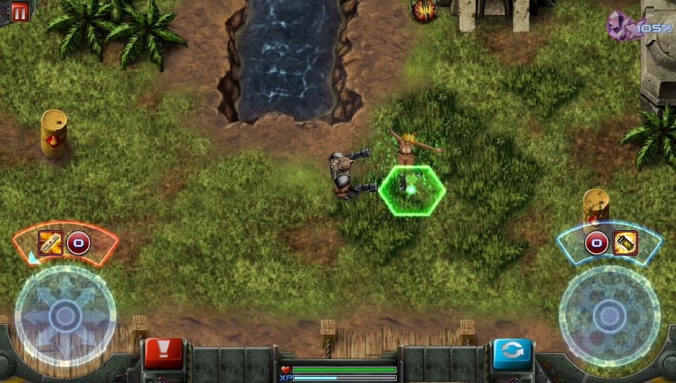

# Gun Bros - PS Vita Port

**Gun Bros** is a top-down twin-stick shooter developed by Glu Mobile.
Play as Percy or Francis Gun and fight endless waves of enemies using a wide variety of weapons and gear. The game combines fast-paced shooting with character and equipment upgrades

> [!WARNING]
> This port was developed with the assistance of LLMs for reverse engineering closed-source applications and implementing parts of the codebase. AI was primarily used to assist with loader crash analysis and certain code implementations. The final result has been manually reviewed and refined; however, as with any complex software project, some unexpected issues or edge cases may still be present.

This is a wrapper/port of **Gun Bros** for the *PS Vita*.

The port works by loading the official Android ARMv7 executable in memory, resolving its imports with native functions and patching it in order to properly run. You must provide your own legally obtained Android APK.

## Changelog

### v1.0

- Initial release.
- Only classic version avaliable
- Vita loader for the Android `libandroidplatformjni.so`
- Vita controls mapped
- The game has a relatively long loading time on shops


## Official Game Download

> [!WARNING]
> The game was delsited from stores but here you can read the wiki.

- [Wiki](https://gunbros.fandom.com/wiki/Gun_Bros)

## Setup Instructions For End Users

1. Install [kubridge](https://github.com/TheOfficialFloW/kubridge/releases/) and [FdFix](https://github.com/TheOfficialFloW/FdFix/releases/) by copying `kubridge.skprx` and `fd_fix.skprx` to your taiHEN plugins folder.

   The folder is commonly `ur0:tai`, but use `ux0:tai` if that is how your Vita is configured. Add both plugins under `*KERNEL` in `config.txt`:

   ```text
   *KERNEL
   ur0:tai/kubridge.skprx
   ur0:tai/fd_fix.skprx
   ```

   Do not install `fd_fix.skprx` if you are already using the rePatch plugin.

2. Install `libshacccg.suprx` to `ur0:/data/` or `ur0:/data/external/`. If you do not have it, follow a [libshacccg extraction guide](https://samilops2.gitbook.io/vita-troubleshooting-guide/shader-compiler/extract-libshacccg.suprx).

3. The game runs correctly at the default 444 MHz CPU clock. For the best performance, however, it's recommended to install [PSVshell](https://github.com/Electry/PSVshell/releases) and overclock the Vita to 500 MHz.

4. Install `Gun_Bros.vpk` with VitaShell. Prepare the data in step 5; the VPK does not contain the Android game assets. The launcher uses these five shared sprites:

   ```text
   ux0:data/gunbros/logos/classic.png
   ux0:data/gunbros/logos/reloaded.png
   ux0:data/gunbros/logos/info_logo.png
   ux0:data/gunbros/logos/choose your version.png
   ux0:data/gunbros/logos/selection arrow.png
   ```

5. Install Python 3.10 or newer and FFmpeg (with the `libvorbis` encoder). Extract **all contents** of your legally obtained Gun Bros Samsung **3.1.4 (314)** APK into a folder. Keep the downloaded game's `files` folder separately.

   Run:

   ```bash
   python prepare_gunbros_data_folder.py
   ```

   In the window:

   - **Files folder here:** select the game's `files` folder containing the BIG packs and MP3 music.
   - **All extracted APK contents here:** select the extracted APK folder containing `assets` and `lib`.
   - Click **Generate folder**.

   The script checks the native library automatically, converts the sounds, and adds the launcher logos. Keep the project's `logos` folder beside the script. FFmpeg is detected automatically; use Browse if it is not found.

   The result is `output/gunbros/` by default. Copy that **gunbros** folder into **`ux0:data/`** on the Vita:

   ```text
   ux0:data/gunbros/
   |-- gunbros_free/       prepared game files and sounds
   |-- gunbros_reloaded/   reserved for Reloaded
   `-- logos/             launcher images
   ```

   You can choose another output location in the window. Use a new folder for each run; existing output is never overwritten. The APK alone is not enough: the downloaded `files` folder is also required.


6. Open Gun Bros from LiveArea and select the version you want to play.

## Controls

| Vita input | Action |
| --- | --- |
| Left analog stick | Move |
| Right analog stick | Aim and shoot |
| Triangle | Change between equipped guns |
| Start | Pause |
| Start + Select | Confirm saving and returning to the version selector |
| D-Pad | Navigate supported game menus |
| Cross | Confirm menu action |
| Circle | Back |
| Touchscreen | Original game/menu touch controls, including on-screen item buttons |

## Build Instructions For Developers

You need a [VitaSDK](https://github.com/vitasdk) environment built for the soft-float ABI. All native dependencies must also be built with `-mfloat-abi=softfp`; do not mix hard-float and soft-float libraries.

The project expects `VITASDK` to be set, or `CMAKE_TOOLCHAIN_FILE` to point at `vita.toolchain.cmake`.

PowerShell example:

```powershell
$env:VITASDK="C:\vitasdk"
$env:Path="$env:VITASDK\bin;$env:Path"
```

Linux/WSL example:

```bash
export VITASDK=/usr/local/vitasdk
export PATH="$VITASDK/bin:$PATH"
```

Install the Vita-side libraries used by `CMakeLists.txt`, built for softfp:

- [vitaGL](https://github.com/Rinnegatamante/vitaGL)
- [vitaShaRK](https://github.com/Rinnegatamante/vitaShaRK)
- [libmathneon](https://github.com/Rinnegatamante/math-neon)
- [kubridge](https://github.com/TheOfficialFloW/kubridge)
- libvita2d freetype libpng libjpeg-turbo zlib libogg libvorbis libsndfile flac opensles SceShaccCgExt soloud taihen

Use a softfp SDK and matching dependency packages.

Build a release VPK:

```bash
cmake -S . -B build -DCMAKE_BUILD_TYPE=Release -DSHADER_FORMAT=GLSL -DUSE_SCELIBC_IO=ON -DDUMP_COMPILED_SHADERS=ON
cmake --build build --parallel 4
```

The build produces `build/Gun_Bros.vpk` and updates the root `Gun_Bros.vpk`. 

---
## Screenshots











---
## Credits

- TheFloW for the original Android `.so` loader work.
- Rinnegatamante for vitaGL and help with Vita ports.
- gl33ntwine/v-atamanenko for SoLoBoP and Android loader boilerplate work.
- The Vita Nuova community and everyone who helped with testing/debugging.
- Vincent and to Xori for worrking on the reloaded version
- Special thanks to Mark030a for testing the latest builds and providing valuable advice and feedback. HE has been working hard on reloaded and testing this port.

## License

This software may be modified and distributed under the terms of the MIT license. See [LICENSE](LICENSE) for details.
